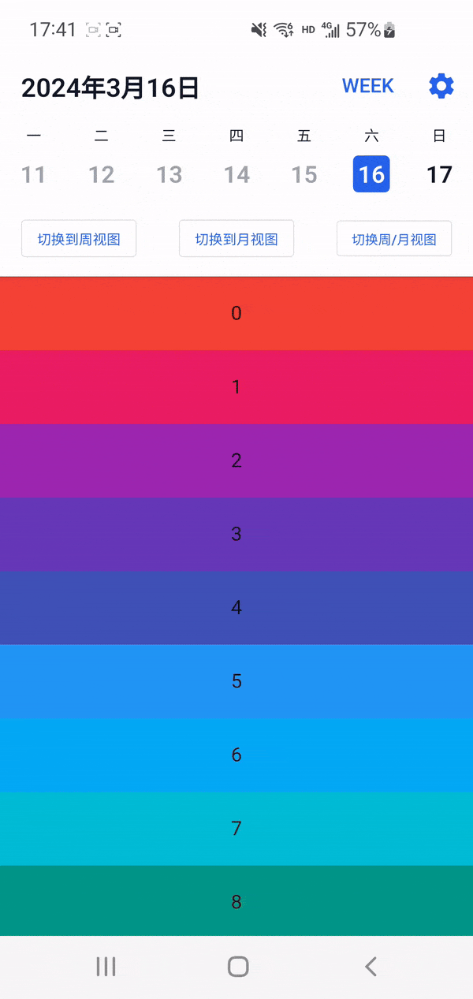
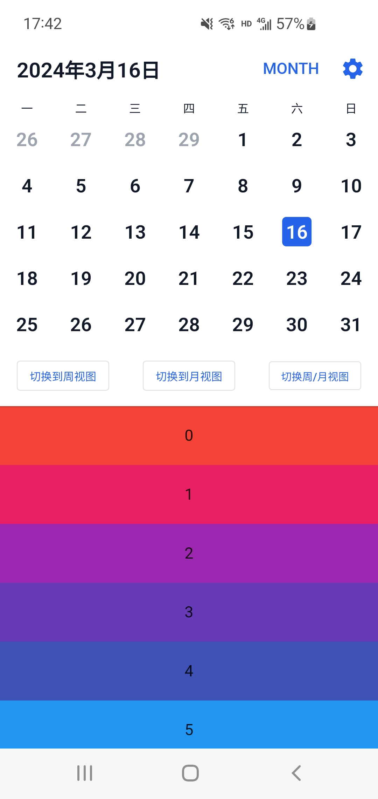
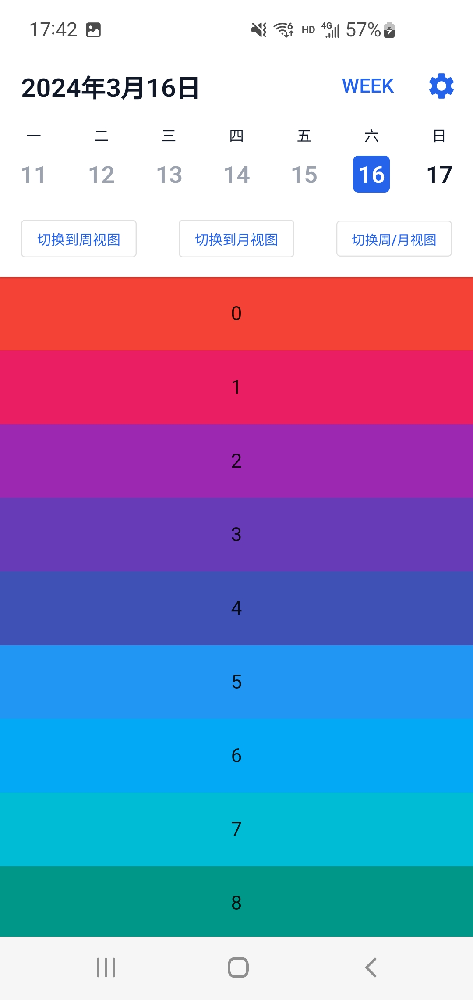

# smart_calendar

智能、轻量级、易于扩展的 flutter 日历控件


## 截图

|                月视图                |               周视图               |
| :----------------------------------: | :--------------------------------: |
|  |  |

## 功能特点

- 🚀 支持月视图和周视图滚动时丝滑切换
- 🎉 易于扩展，支持自定义 UI

## 使用

```dart
  @override
  Widget build(BuildContext context) {
    return Scaffold(
      body: SmartCalendar(
        backgroundColor: Colors.white,
        rowHeight: 44,
        calendarController: calendarController,
        calendarFormat: CalendarFormat.WEEK,
        onCalendarFormatChanged: _onCalendarFormatChange,
        onItemClick: _onCalendarItemClick,
        itemBuilder: _buildCalendarItem,
        slivers: _buildSlivers(),
      )
    );
  }
```
